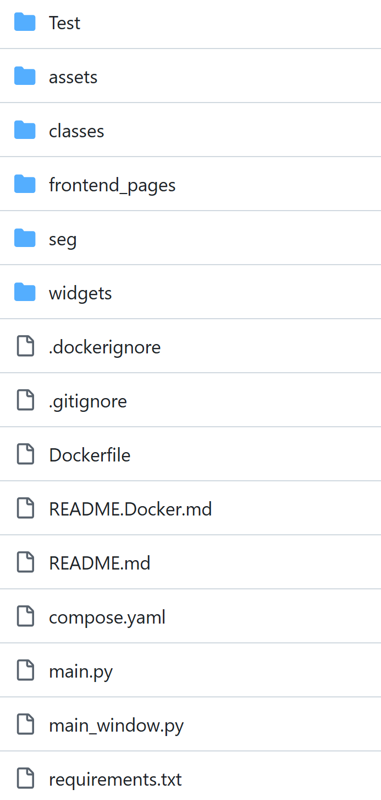
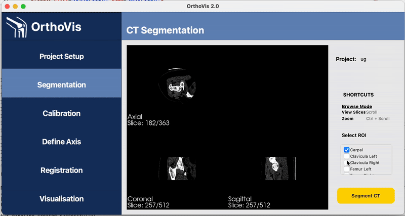

# 🦴 OrthoVis 2.0 - Installation & Setup Guide

Welcome to **OrthoVis 2.0**, a joint motion assessment toolkit for accurate 3D analysis using CT and fluoroscopy data.

---
## IMPORTANT: Please read through the State-of-project pdf file to see what has been done and what needs to be done next
## 📦 Required Dependencies

Ensure the following Python packages are installed:

- `ImageIO`: a Python library to read and write image data
- `Matplotlib`: a plotting library for creating static, animated, and interactive visualizations
- `NumPy`: a fundamental package for scientific computing with Python
- `OpenCV-Python`: Open Source Computer Vision Library
- `Pydicom`: a pure Python package for working with DICOM files
- `PySide6`: Python bindings for the Qt application framework
- `SciPy`: open-source library for scientific and technical computing
- `SimpleITK`: open-source library designed for multi-dimensional image analysis
- `Scikit-Image`: library designed for image processing and computer vision tasks
- `TotalSegmentator`: a tool for automated medical image segmentation (you will need to get your own license key for this dependency [here](https://backend.totalsegmentator.com/license-academic/))
- `VTK`: Visualization Toolkit for 3D computer graphics, image processing, and visualization

These dependencies can be found in the `requirements.txt` file and versions are not specififed to let pip install the latest compatible versions.

---

## 🗂 Project Structure Overview

The **OrthoVis 2.0** project follows a modular and organized directory structure. Each directory is responsible for a specific functionality within the application.



### 📁 `assets/`

Contains SVG diagrams illustrating key workflows in documentation such as projection, segmentation, and registration, and images used in the UI.

### 📁 `classes/`

Core logic and reusable components:
- `objects.py`: Implements `Singleton`, `State` design pattern and other useful data structures.
- `lib.py`: Common utility functions.
- `utils.py`: Helper functions for dialog boxes, file handling, etc.

### 📁 `frontend_pages/`

Main application frontend pages built with PySide6:

- `startup/`: Home screen (e.g. `startup_window.py`)
- `project_setup/`: UI and logic for project description and importing CT & Fluoroscopy data
- `segmentation/`: Image segmentation interface  
- `calibration/`: Fluoroscopy calibration interface
- `registration/`: 2D-3D registration interface
- `define_axis/`: Define axes interface
- `visualisation/`: 3D visualization - final output interface
  
Each folder contains `.ui` (Qt Designer), `ui_*.py` (generated), and functional `.py` files.

### 📁 `widgets/`

Reusable subcomponents for consistent UI across pages:
- `sidebar/`: Sidebar navigation widget     
- `titlebar/`: Title bar widget
 
Each folder contains `.ui` (Qt Designer), `ui_*.py` (generated), and functional `.py` files.

### 📁 `seg/`

CT segmentation and 3D data processing scripts:
- `totalseg.py`: fully automated CT segmentation using TotalSegmentator 
- `embedding.py`: integration of VTK visualisation widget with frontend
- `renderer.py`: (archived) standalone testing of VTK visualisation widget

### 📁 `Projects/`

Stores data of existing projects in subfolders.

### 📁 `Test/`

Contains unit tests for the application.

### 📄 `main_window.py` / `main.py`

Entry points of the application.
- `main_window.py`: Controls page logic and stack view with `QStackedWidget`.
- `main.py`: Initializes and runs the application.

### 📄 `README.Docker`

Instructions for building and deploying the application using Docker.

### 📄 `README.md`

Top-level file describing the project and how to install and use it.

### 📄 `requirements.txt`

Lists all required Python packages for easy installation via pip.

---

## 🛠 Installation Steps

1. Ensure you are using compatible version of Python.

2. Create and activate a virtual environment (recommended):
   ```bash
   python -m venv ortho_env
   source ortho_env/bin/activate
   # On Windows use `ortho_env\Scripts\activate`
   ```
3. Install required dependencies:
   ```bash
   pip install -r requirements.txt # Add --user if not using a virtual environment to avoid permission issues
   ```
4. Run the main application using the `Run` configuration in your IDE or execute:
   ```bash
   python main_window.py
   ```
---

- For documentation, minutes, and software engineering practices, please refer to our [Wiki](https://github.com/sdpunit/OrthoVis/wiki).


- Please look at our [Project landing page](https://orthovis2.wixsite.com/orthovis-2) to learn more about the project and our team members. 


## User Guide 

Below we will present a visual walkthrough of OrthoVis, from setup of project to the registration module.

### Module 1: Project Setup

#### Purpose

The Project Setup module allows users to create or adjust project details (name and description) and import medical imaging data (CT scans and fluoroscopy sequences).

---

#### How It Works

- Users can create a new project or open an existing one.
- Project details can be edited as needed.
- CT and fluoroscopy data can be imported from DICOM files and can be removed if necessary.
- The project details is saved in a structured format for later use in subsequent modules.
- Imported files are saved in a dedicated project folder.

---

#### Workflow


**For new projects:**

1. Click "New Project" from the Homepage
2. Enter project name and description
3. Click "Import CT Data" to select and load a folder of DICOM files for the CT scan
4. Click "Import Fluoroscopy Data" to select and load a folder of DICOM files for the fluoroscopy sequence
5. Click "Save" to proceed to the Segmentation module

**For existing projects:**

1. Click "Open Project" from the Homepage
2. Edit any project details as needed
3. Click "Save" to proceed to the Segmentation module

### Module 2a: Segmentation (Browse mode, pre-segmentation)

#### Purpose
The raw CT data, imported previously in the setup module, is visually rendered in an interactive widget to allow the user review its quality before launching into segmentation. Multi-view inspection of the CT volume from the axial, coronal and sagittal planes empowers the user with flexibility to examine the subject with their desired level of detail. Once satisfied, the user selects the bones (regions) of interest to perform segmentation on. 

--- 
#### How It Works
- In-depth inspection of the CT data in each quadrant plane includes 3 controlled functionalities: zoom in/out, pan, scrolling through volume slices in each plane. The keyboard/mouse controls are detailed in the Controls section below.
- Bones/regions of interest for segmentation should be selected from the dropdown menu. As of Nov 2025, the curated options are filtered from the pre-trained categories in the [TotalSegmentator repository](https://github.com/wasserth/TotalSegmentator), focusing on the hip and limbs. Further modifications may be introduced, per client needs. 

---
#### Controls 
| Action | Function |
| ------ | -------- |
| Scroll through slices | Mouse scroll | 
| Zoom in/out | Ctrl + Scroll |
| Pan | Ctrl + Shift + Left drag |

---
#### Workflow 



1. Verify that the quality of imported CT is satisfactory, by inspecting the CT volume slices across the plane views and making use of the controls, if desired. 
2. Select bones of interest to segment from CT.
3. Click the "Segment CT" button to call TotalSegmentator model. 
---

### Module 2b: Segmentation (Edit/Browse mode, post-segmentation) 

#### Purpose
Due to resolution discrepancies in TotalSegmentator's training data and our raw CT data, some slices in the resulting masks are of subpar accuracy and precision, which may adversely affect quality in downstream registration tasks. To improve mask quality, users may use the brush feature to manually remove or add pixels to slices before proceeding to the next calibration module. 

--- 
#### How It Works
- During segmentation, the TotalSegmentator is called and runs in the background. The user is notified of the status with the pop-up dialogue box, which remains on screen in-progress, and only vanishes when segmentation is complete.
- The output masks are automatically overlaid on top of the original CT with distinct colour-coding scheme and name labels. Additional editing features are introduced in the widget's top-right quadrant.
- All edits made in the interactive widget is temporary until saved with the S keyboard shortcut or the `Save edits` button on GUI. 

--- 
#### Controls
All controls implemented in the pre-segmentation browsing mode are valid in the edit mode. Explicitly, they are:
| Action | Function |
| Scroll through slices | Mouse scroll | 
| Zoom in/out | Ctrl + Scroll |
| Pan | Ctrl + Shift + Left drag |

Additionally, the user may use the following controls to edit segmentation masks: 

| Action | Function |
| ------ | -------- |
| Switch between Browse/Edit mode | Left click on the text `Mode: Browse` OR `Mode: Edit` | 
| Toggle mask on | Left click on desired bone mask name (automatically toggles off other masks) |
| Add pixels to current mask | Left click + drag |
| Erase pixels to current mask | Ctrl + left click + drag|
| Increase brush size | + button |
| Decrease brush size | - button |
| Save all edits | S button |

---
#### Workflow 


1. Once segmentation is complete, the output masks are colour-coded and automatically overlaid atop the original CT for user inspection. 
2. Use controls in Browse mode to inspect the segmentation masks' slice by slice in each plane, for discrepancies between desired and actual accuracy/precision. 
3. Use controls in Edit mode to manually edit pixels in each slice of concern. 
4. Save edits whenever desired, whether in progress or after all elected changes are made. As a final safeguard, the save feature is automatically activated before proceeding to the next calibration module. 

--- 

### Module 3: Calibration

#### Purpose

The Calibration module is designed to provide accurate geometric correction for fluoroscopy and X-ray images using an AutoAlign grid-based method. It aims to eliminate image distortion caused by diffraction from the light source. 

---

#### How It Works

The theory section in  is helpful to understand the technicality. To explain this in simpler words: fluoro images are warped, since diffraction from the light source creates distortion of the resulting object's image. To fix this, we take a fluoroscopy shot of a calibration cube (or square grid) with beads placed on it in the front (red beads) and back (blue beads). You detect where those beads land in the distorted image and fit a mapping (an overlay grid) that projects them back to their true evenly spaced positions. This mapping is then applied to every frame of your fluoro to correct for distortion effects.

---

#### Workflow 
1. Import calibration grid: click `Load Calibration Grid` button and select appropriate fluoroscopy file.
2. Invert grid (_optional_) Ideally, the beads in the calibration grid should have high contrast with the background. This usually means white beads (high intensity) against grey background, but the `Invert Grid` option exists to invert pixel intensity if the user prefers this display mode.  
3. Click on `Overlay Square Grid` button to initiate alignment of grid layers with beads. Please double-check the default calibration parameters generated in the pop-up window, modifying values if your setup is different.
4. Use the grid controls in the navigation sidebar (also included below for reference) to manually align both the front (red) and back (blue) square grid with beads **within a margin of about 10 pixels. **

_This crucial to get right before running next step's snapping algorithm, which has a hard search radius of 14 pixels. Staying within 10 pixels ensures reliable sub-pixel centroid accuracy and avoids any risk of snapping to a neighbouring bead._

6. When satisfied with alignment, click `Snap to Beads` for algorithm to auto-adjust the grid layers to centre of detected beads. Double-check that the snapping is valid and satisfactory before proceeding to the next step. If unhappy, repeat steps 4-5.
7. When satisfied with snapped positions, click `Correct Distortion` for the matrix projection algorithm to correct for image distortion.
8. Click `Save Correction` or `Ctrl + S` to save corrections as `pkl` file.
_The image should visibly sharpen and straighten, particularly at the edges. The overlay circles will reproject onto the corrected image; bead alignment should improve relative to the pre-correction state._

---

⌨️ Grid Layer Controls

| Key       | Action                                        |
| --------- | --------------------------------------------- |
| `← ↑ ↓ →` | Translate model (use **Shift** for ×5 speed). |
| `A / D`   | Rotate counterclockwise / clockwise.          |
| `- / =`   | Scale down / up.                              |
| `Enter`   | Confirm current layer and continue.           |
| `Esc / Q` | Exit current layer.                           |

---

#### Future Improvements

1. Testing and debugging of the complete calibration module within the OrthoVis application. 

### Module 4: Define Axes

The Define Axes module has not been completed as of NOV 2025. Users can navigate into and out of the module page using the navigation side-bar.

### Module 5: Registration

#### Purpose

The Registration module aligns 3D CT-derived bone masks with 2D fluoroscopy images. It lets you load medical imaging data and manually adjust alignment in real time using an interactive VTK display.

---

#### How It Works

- The background shows the fluoroscopy frame (DICOM).
- The foreground shows a flattened bone mask (edge map) generated from the CT.
- Adjustments can be made to match the bone outline with the fluoroscopy anatomy.

---

#### Controls

| Action | Function |
|--------|-----------|
| **Left-click + Drag** | Move overlay (X/Y translation) |
| **Mouse Scroll** | Move overlay forward/back (Z translation) |
| **Ctrl + Drag** | Rotate overlay (X/Y out-of-plane and Z spin) |
| **Pose Fields** | Manually enter translation/rotation values |

---

#### Workflow

1. Open the Registration page — the fluoroscopy loads automatically.  
2. Click Load Bone Mask to generate and display the bone edge overlay.  
3. Use mouse or numeric fields to fine-tune alignment.  
4. For out-of-plane rotations (X/Y), the system reprojects the CT volume and recomputes the flattened image.

---

#### Notes

- Out-of-plane rotations may take several seconds while the 3D projection recomputes.  
- The overlay is always drawn on top of the fluoroscopy.  
- The module is incompleted, you may incounter bugs.
- The module is not linked to a registration AI model yet, in it's current state, the user is unable to progress further.


